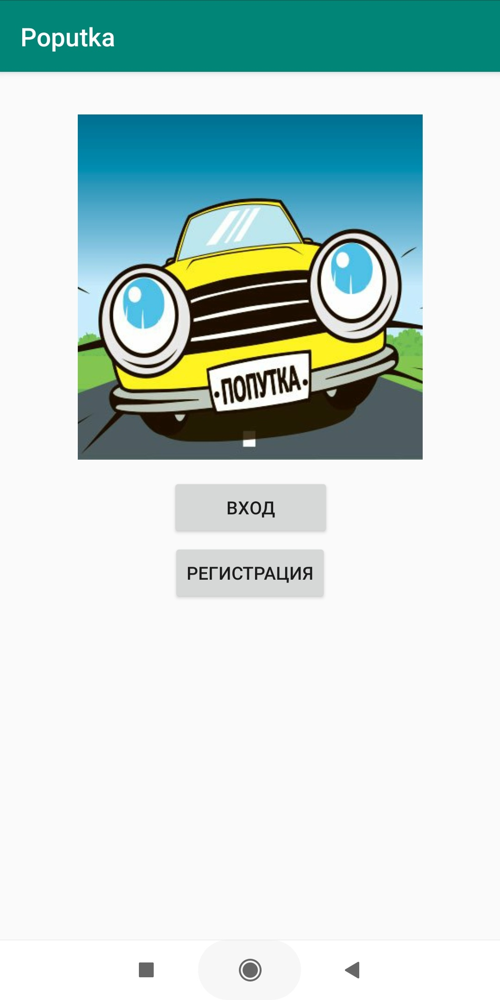
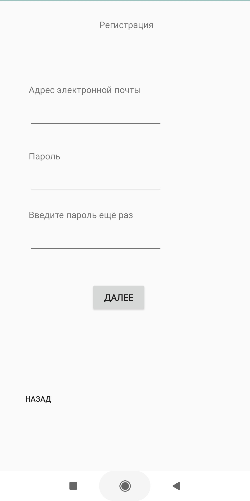
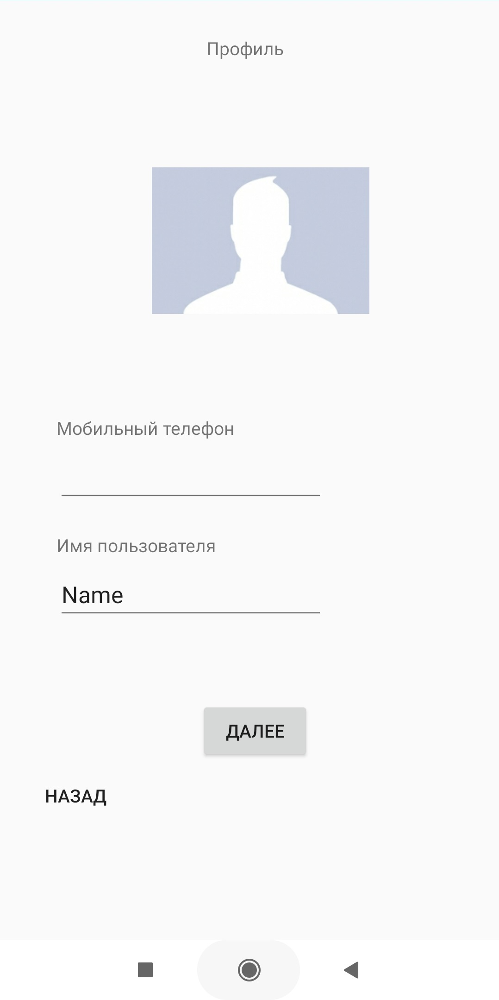
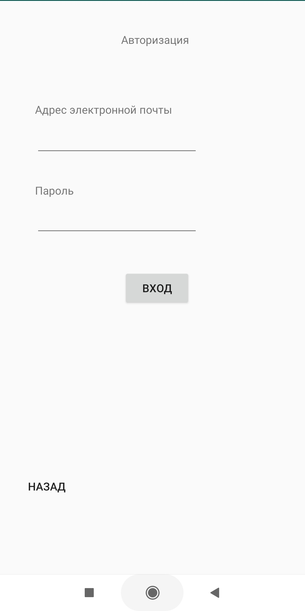
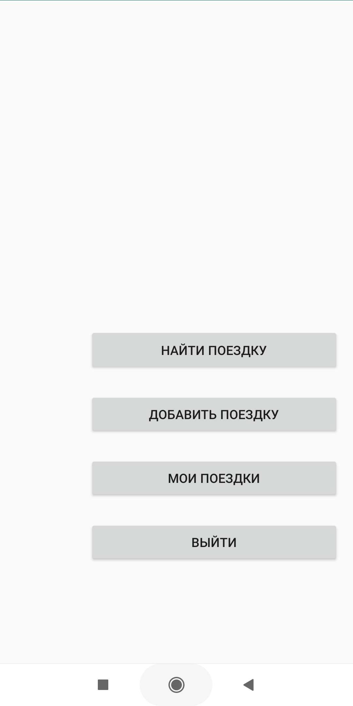
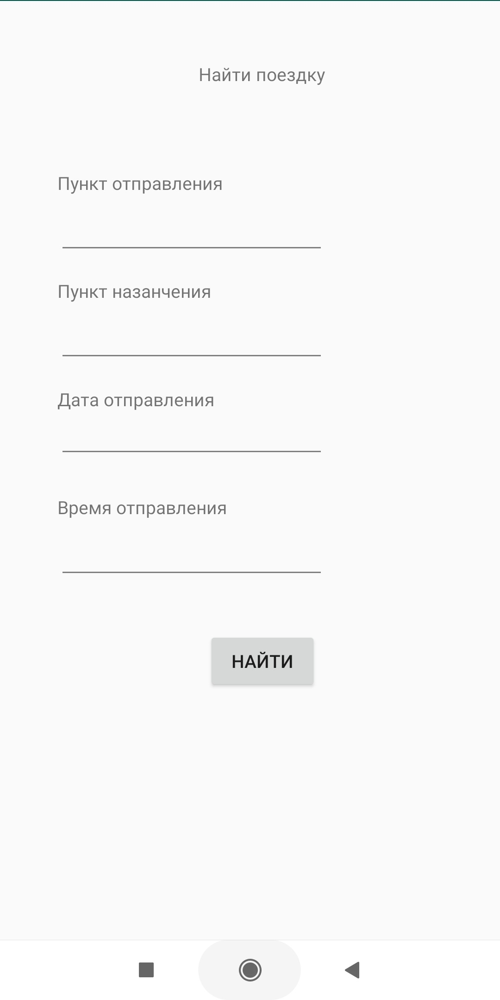
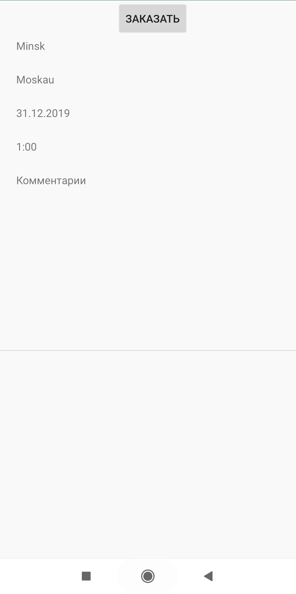
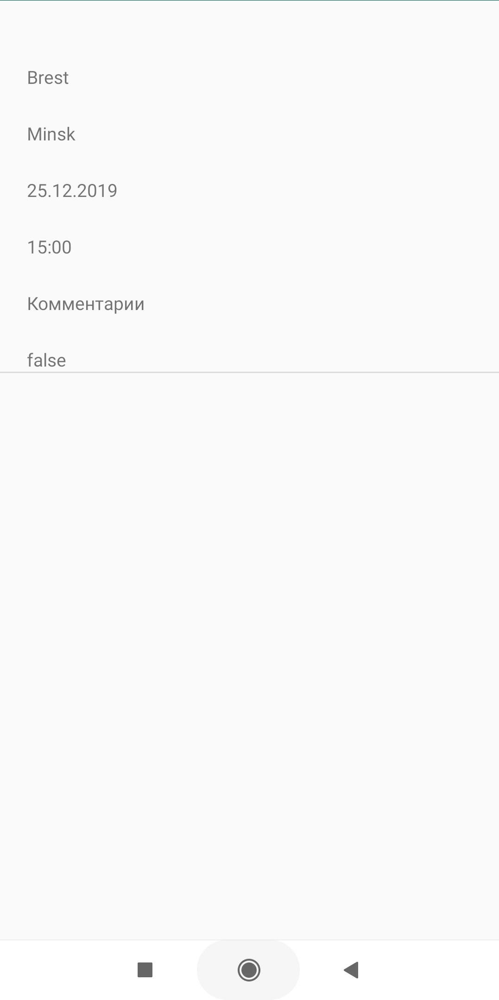

# Представление результатов

| ID | Назначение/название | Сценарий | Ожидаемый результат | Фактический результат | Оценка |
|:---:|:---:|:---|:---|:---|:---|
| 1 | Регистрация нового аккаунта пользователя | 1. Запустите приложение, откроется [стартовое окно](#1) приложения.  2. Нажмите кнопку "Регистрация".  3. В открывшемся [окне](#2) введите адрес электронной почты и пароль. 4. Нажмите кнопку "Зарегистрироваться". 5. Произошло перенаправление на [окно заполнения](#3) профиля. 6. В появившемся окне введите имя пользователя и зугрузите фото пользователя, нажмите кнопку "Зарегистрироваться".| Произошло перенаправление на [главную страницу](#5) приложения. | | |
| 2 | Регистрация уже сущестующего аккаунта пользователя | 1. Запустите приложение, откроется [стартовое окно](#1) приложения.  2. Нажмите кнопку "Зарегистрироваться".  3. На открывшейся [странице](#2) введите имя пользователя и пароль, уже сущестующего аккаунта в системе. 4. Нажмите кнопку "Зарегистрироваться".| Появилось сообщение с уведомлением о том, что данное имя уже занято. | | |
| 3 | Вход в зарегистрированный аккаунт | 1. Запустите приложение, откроется [стартовое окно](#1) приложения.  2. Нажмите кнопку "Вход".  3. В открывшемся [окне](#4) введите адрес электронной почты и пароль, уже сущестующего аккаунта в системе. 4. Нажмите кнопку "Войти".| Произошло перенаправление на [главную страницу](#5) приложения.| | |
| 4 | Добавление новой поездки | 1. Выполните сценарий 3.  2. Нажмите кнопку "Добавить поездку".  3. На открывшейся [странице](#5) заполните все обязательные поля. 4. Нажмите кнопку "Добавить".| Произошло перенаправление на [главную страницу](#5) приложения.| | |
| 5 | Поиск поездки| 1. Выполните сценарий 3.  2. Нажмите кнопку "Найти поездку".  3. На открывшейся [странице](#6) заполните все обязательные поля. 4. Нажмите кнопку "Найти".| Появилось [окно](#7) содержащее список выбранных по критериям поездок. | | |
| 6 | Заказ поездки | 1. Выполните сценарий 5.  2. Выберите поездку и нажмите кнопку «Заказать».  | Произошло перенаправление на [главную страницу](#5) приложения. | | |
| 7 | Просмотр поездок пользователя | 1. Выполните сценарий 3. 2. Нажмите кнопку «Мои поездки». | Появилось [окно](#8) содержащее список когда-либо добавленных пользователем поездок. | | |
| 8 | Выход из аккаунта| 1. Выполните сценарий 3. 2. Нажмите на кнопку "Выйти".| Произошло перенаправление на [стартовое окно](#1) приложения. | | |
| 9 | Вход в незарегистрированный аккаунт| 1. Запустите приложение, откроется [стартовое окно](#1) приложения.  2. Нажмите кнопку "Вход".  3. В открывшемся [окне](#2) введите имя пользователя и пароль, несущестующего аккаунта в системе и нажмите кнопку «Вход». | Появилось сообщение на странице с уведомлением о том, что аккаунт не найден в ситстеме. | | |
| 10 | Переписка с водителем| 1. Выполните сценарий 5. 2. Нажмите кнопку "Сообщения". | В открывшемся окне ведётся переписка с водителем. |  | |
|  |  |  |  |  |  |

# Иллюстрации

<a name="1"/>

Рисунок 1.

<a name="2"/>

Рисунок 2.

<a name="3"/>

Рисунок 3.

<a name="4"/>

Рисунок 4.

<a name="5"/>

Рисунок 5.

<a name="6"/>

Рисунок 6.

<a name="7"/>

Рисунок 7.

<a name="8"/>

Рисунок 8.

